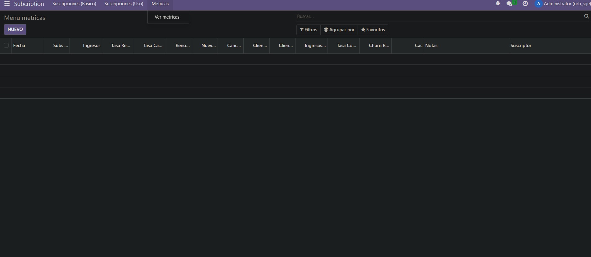
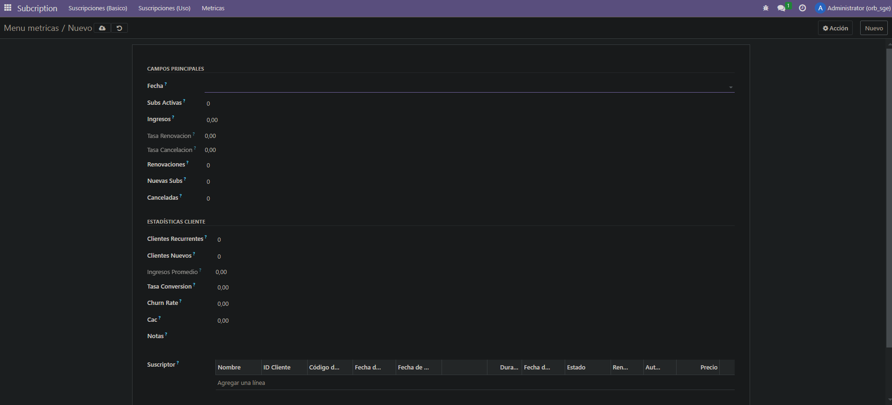

Resultados:




Código de lo modificado para el proyecto:
# metricas.py

```

# -*- coding: utf-8 -*-

from odoo import models, fields, api
from datetime import date, timedelta
from dateutil.relativedelta import relativedelta

class metricas(models.Model):
    _name = 'subscription.metricas'
    _description = 'subscription.metricas'

    fecha = fields.Date(string="Fecha")
    subs_activas = fields.Integer()
    ingresos = fields.Float()
    tasa_renovacion = fields.Float(compute="calcular_renovacion", store=True)
    tasa_cancelacion = fields.Float(compute="calcular_cancelacion", store=True)
    renovaciones = fields.Integer()
    nuevas_subs = fields.Integer()
    canceladas = fields.Integer()
    clientes_recurrentes = fields.Integer()
    clientes_nuevos = fields.Integer()
    ingresos_promedio = fields.Float(compute="calcular_promedio", store=True)
    tasa_conversion = fields.Float()
    churn_rate = fields.Float()
    lifetime_value = fields.Float()
    cac = fields.Float()
    notas = fields.Text()
    suscriptor = fields.One2many(
        string='Suscriptor',
        comodel_name='subscription.subscription',
        inverse_name='metricas',
    )
    
    
    
    
    @api.depends('renovaciones', 'subs_activas')
    def calcular_renovacion(self):
        for p in self:
            if p.subs_activas != 0:
                p.tasa_renovacion = (p.renovaciones / p.subs_activas) * 100
            else:
                p.tasa_renovacion = 0.0
    
    @api.depends('canceladas', 'subs_activas')
    def calcular_cancelacion(self):
        for p in self:
            if p.subs_activas != 0:
                p.tasa_cancelacion = (p.canceladas / p.subs_activas) * 100
            else:
                p.tasa_cancelacion = 0.0
    
    @api.depends('ingresos', 'subs_activas')
    def calcular_promedio(self):
        for p in self:
            if p.subs_activas != 0:
                p.ingresos_promedio = p.ingresos / p.subs_activas
            else:
                p.ingresos_promedio = 0.0

```

# ir.model.access.csv

```
id,name,model_id:id,group_id:id,perm_read,perm_write,perm_create,perm_unlink
access_subscription_subscription,Subscription,model_subscription_subscription,base.group_user,1,1,1,1
access_subscription_metricas,Metricas,model_subscription_metricas,base.group_user,1,1,1,1
```


# init.py

```
# -*- coding: utf-8 -*-

from . import models
from . import metricas

```

# vista_metricas.xml

```
<odoo>
  <data>
    <!-- explicit list view definition -->

    <record model="ir.ui.view" id="subscription.menu_metricas">
      <field name="name">Menú Métricas</field>
      <field name="model">subscription.metricas</field>
      <field name="arch" type="xml">
        <tree> 
          <field name="fecha"/>
          <field name="subs_activas"/>
          <field name="ingresos" />
          <field name="tasa_renovacion"/>
          <field name="tasa_cancelacion"/>
          <field name="renovaciones"/>
          <field name="nuevas_subs"/>
          <field name="canceladas"/>
          <field name="clientes_recurrentes"/>
          <field name="clientes_nuevos"/>
          <field name="ingresos_promedio"/>
          <field name="tasa_conversion"/>
          <field name="churn_rate"/>
          <field name="cac"/>
          <field name="notas"/>
          <field name="suscriptor"/>
        </tree>
      </field>
    </record>

<record model="ir.ui.view" id="subscription.form_metricas">
  <field name="name">Menu metricas Form</field>
  <field name="model">subscription.metricas</field>
  <field name="arch" type="xml">
    <form string="Formulario">
      <sheet>
        <group string="Campos principales">
          <field name="fecha"/>
          <field name="subs_activas"/>
          <field name="ingresos" />
          <field name="tasa_renovacion"/>
          <field name="tasa_cancelacion"/>
          <field name="renovaciones"/>
          <field name="nuevas_subs"/>
          <field name="canceladas"/>
        </group>
        <group string="Estadísticas cliente">
          <field name="clientes_recurrentes"/>
          <field name="clientes_nuevos"/>
          <field name="ingresos_promedio"/>
          <field name="tasa_conversion"/>
          <field name="churn_rate"/>
          <field name="cac"/>
          <field name="notas"/>
          <field name="suscriptor"/>
        </group>
      </sheet>
    </form>
  </field>
</record>


    <!-- actions opening views on models -->

    <record model="ir.actions.act_window" id="subscription.action_metricas">
      <field name="name">Menu metricas</field>
      <field name="res_model">subscription.metricas</field>
      <field name="view_mode">tree,form</field>
      <field name="view_id" ref="subscription.menu_metricas"></field>
    </record>

  </data>
</odoo>

```

# manifest.py

```
# -*- coding: utf-8 -*-
{
    'name': "subscription",

    'summary': """
        Short (1 phrase/line) summary of the module's purpose, used as
        subtitle on modules listing or apps.openerp.com""",

    'description': """
        Long description of module's purpose
    """,

    'author': "My Company",
    'website': "https://www.yourcompany.com",

    # Categories can be used to filter modules in modules listing
    # Check https://github.com/odoo/odoo/blob/16.0/odoo/addons/base/data/ir_module_category_data.xml
    # for the full list
    'category': 'Uncategorized',
    'version': '0.1',

    # any module necessary for this one to work correctly
    'depends': ['base'],

    # always loaded
    'data': [
        'security/ir.model.access.csv',
        'views/vista_basica.xml',
        'views/vista_uso.xml',
        'views/vista_metricas.xml',
        'views/menu.xml',
        'views/static_web.xml',
        'views/sub_list_web.xml',
        'views/templates.xml',
    ],
    # only loaded in demonstration mode
    'demo': [
        'demo/demo.xml',
    ],
}

```
