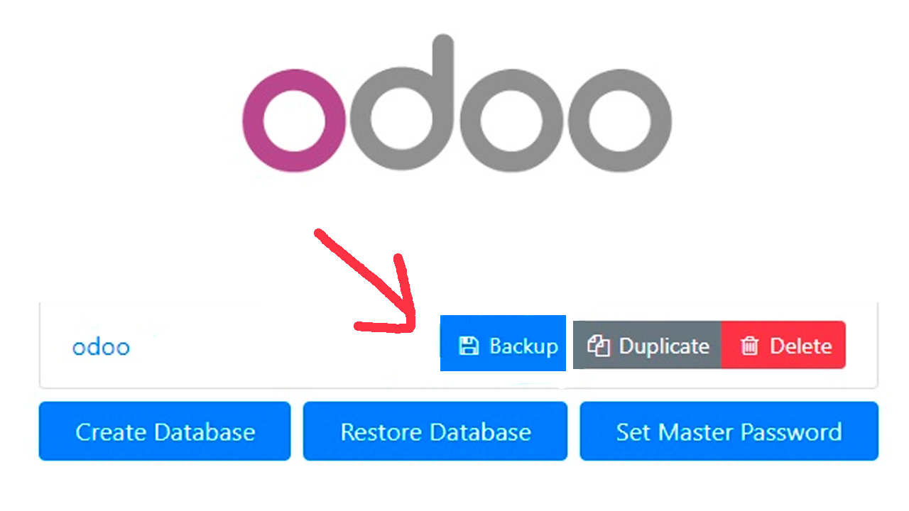

# Práctica 3

1. Pongo el siguiente comando para crear el archivo backup.sql


2. Saco el archivo de Linux a mi directorio de Windows


3. Borro los contenedores (Borro también todo el contenido de dataPG y volumesOdoo)


4. Ejecuto de nuevo el docker compose e inicio el db


5. Muevo el backup al docker


6. Creo una nueva base de datos


7. Restauro la copia

```psql -U odoo odoo < backup.sql```


# EJERCICIO 2
1. Voy al lugar de la creación del backup



2. Descargo el .zip
3. Borro todo el contenido de la BD
4. Descomprimo el .zip en la carpeta