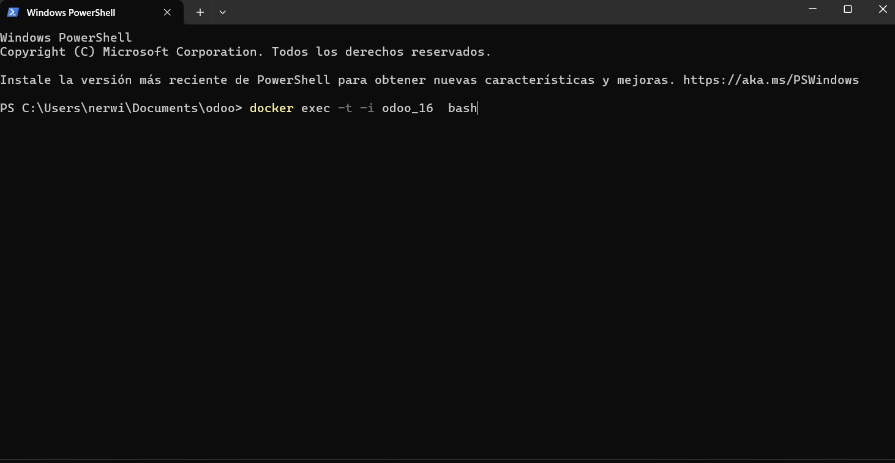
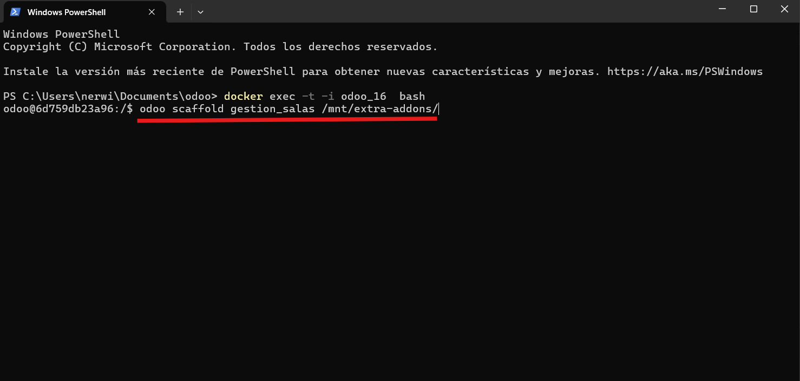
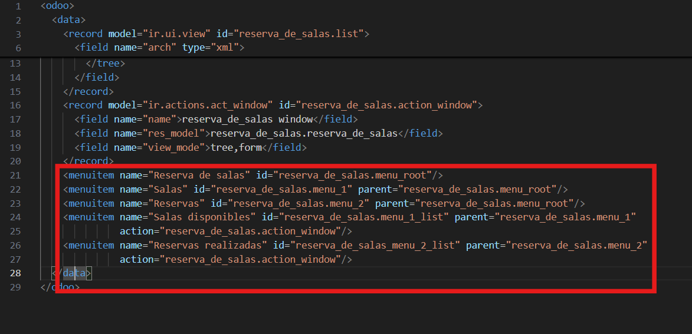
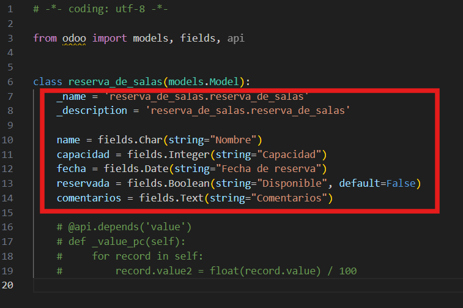
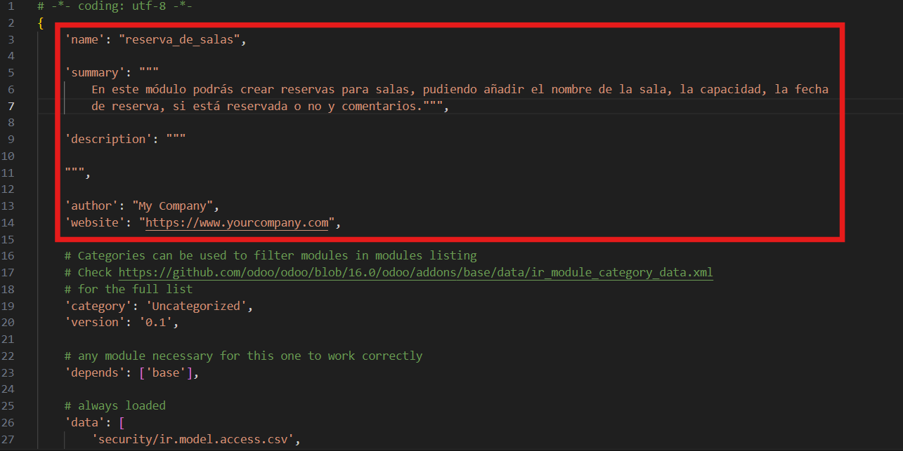
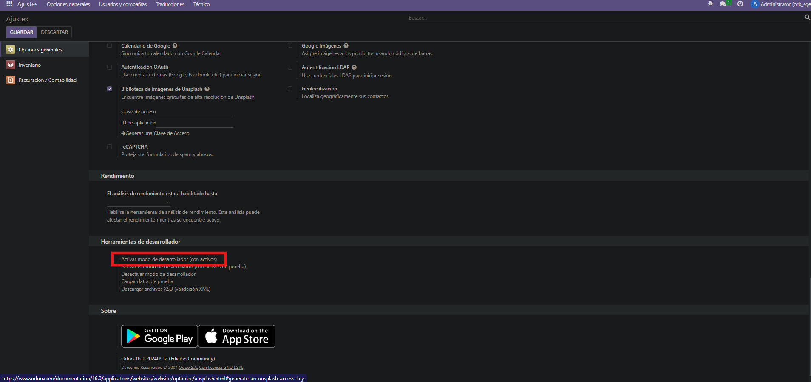
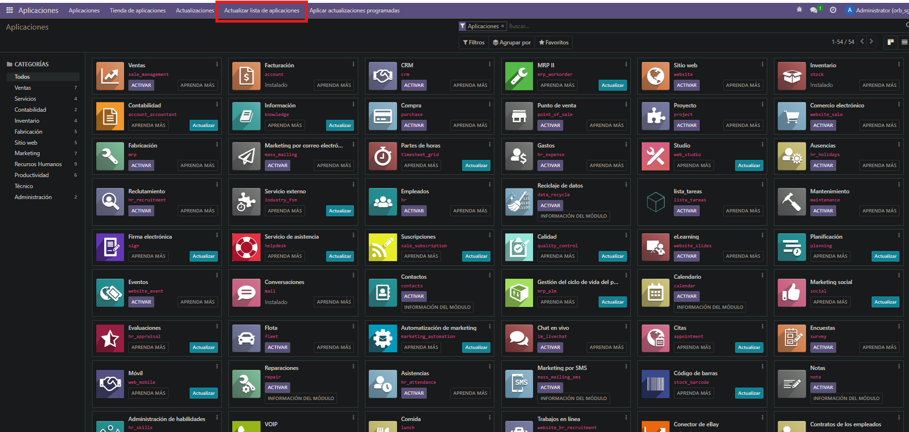
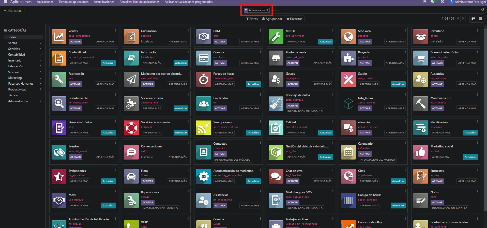
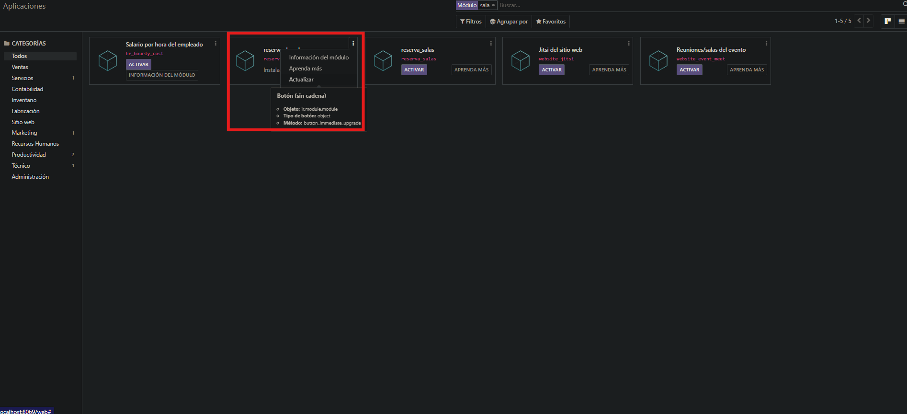

# Práctica 1
Primero entramos a la consola de Odoo


Creo los directorios para el módulo con el commando odoo scaffold


Creo los menús en el fichero views.xml


Añado los datos que quiera usar en el módulo en models


Añado la información sobre el módulo en manifest


Vouy a Ajustes, bajo abajo del todo y le doy a Activar modo de desarrollador (con activos)


Voy a aplicaciones y le doy a actualizar lista de aplicaciones


Quita el filtro


Busco por nombre y en los tres puntos le doy a Instalar


```
# -*- coding: utf-8 -*-

from odoo import models, fields, api


class reserva_de_salas(models.Model):
    _name = 'reserva_de_salas.reserva_de_salas'
    _description = 'reserva_de_salas.reserva_de_salas'

    name = fields.Char(string="Nombre")
    capacidad = fields.Integer(string="Capacidad")
    fecha = fields.Date(string="Fecha de reserva")
    reservada = fields.Boolean(string="Disponible", default=False)
    comentarios = fields.Text(string="Comentarios")

    # @api.depends('value')
    # def _value_pc(self):
    #     for record in self:
    #         record.value2 = float(record.value) / 100

```

```
id,name,model_id:id,group_id:id,perm_read,perm_write,perm_create,perm_unlink
access_reserva_de_salas_reserva_de_salas,reserva_de_salas.reserva_de_salas,model_reserva_de_salas_reserva_de_salas,base.group_user,1,1,1,1
```

```
<odoo>
  <data>
    <record model="ir.ui.view" id="reserva_de_salas.list">
      <field name="name">reserva_de_salas list</field>
      <field name="model">reserva_de_salas.reserva_de_salas</field>
      <field name="arch" type="xml">
        <tree>
          <field name="name"/>
          <field name="capacidad"/>
          <field name="fecha"/>
          <field name="reservada"/>
          <field name="comentarios"/>
        </tree>
      </field>
    </record>
    <record model="ir.actions.act_window" id="reserva_de_salas.action_window">
      <field name="name">reserva_de_salas window</field>
      <field name="res_model">reserva_de_salas.reserva_de_salas</field>
      <field name="view_mode">tree,form</field>
    </record>
    <menuitem name="Reserva de salas" id="reserva_de_salas.menu_root"/>
    <menuitem name="Salas" id="reserva_de_salas.menu_1" parent="reserva_de_salas.menu_root"/>
    <menuitem name="Reservas" id="reserva_de_salas.menu_2" parent="reserva_de_salas.menu_root"/>
    <menuitem name="Salas disponibles" id="reserva_de_salas.menu_1_list" parent="reserva_de_salas.menu_1"
              action="reserva_de_salas.action_window"/>
    <menuitem name="Reservas realizadas" id="reserva_de_salas_menu_2_list" parent="reserva_de_salas.menu_2"
              action="reserva_de_salas.action_window"/>
  </data>
</odoo>
```

```
# -*- coding: utf-8 -*-

from . import controllers
from . import models
```

```
# -*- coding: utf-8 -*-
{
    'name': "reserva_de_salas",

    'summary': """
        En este módulo podrás crear reservas para salas, pudiendo añadir el nombre de la sala, la capacidad, la fecha
        de reserva, si está reservada o no y comentarios.""",

    'description': """
       
    """,

    'author': "My Company",
    'website': "https://www.yourcompany.com",

    # Categories can be used to filter modules in modules listing
    # Check https://github.com/odoo/odoo/blob/16.0/odoo/addons/base/data/ir_module_category_data.xml
    # for the full list
    'category': 'Uncategorized',
    'version': '0.1',

    # any module necessary for this one to work correctly
    'depends': ['base'],

    # always loaded
    'data': [
        'security/ir.model.access.csv',
        'views/views.xml',
        'views/templates.xml',
    ],
    # only loaded in demonstration mode
    'demo': [
        'demo/demo.xml',
    ],
}

```