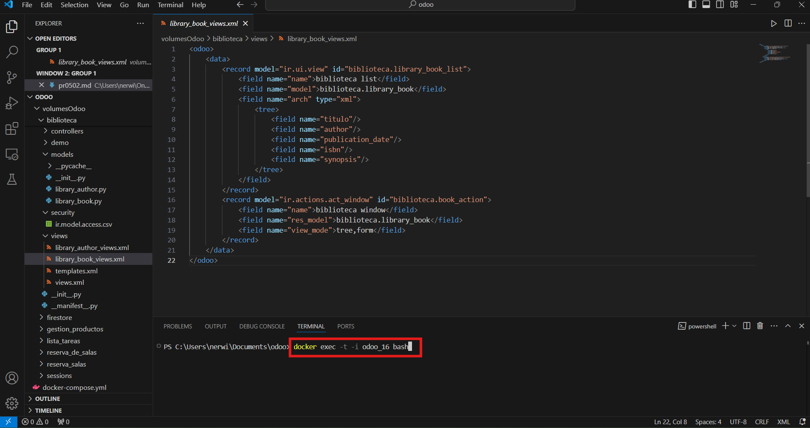
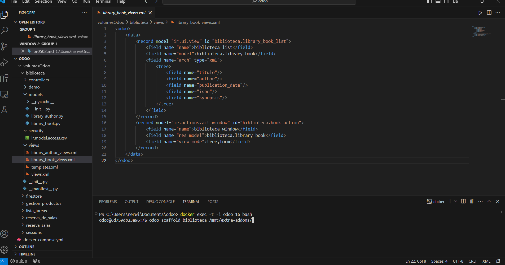
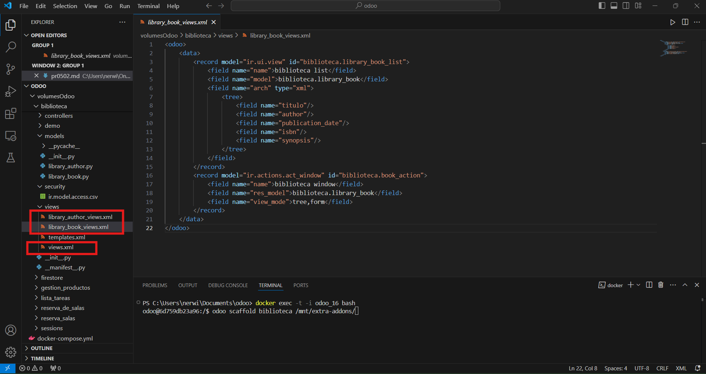
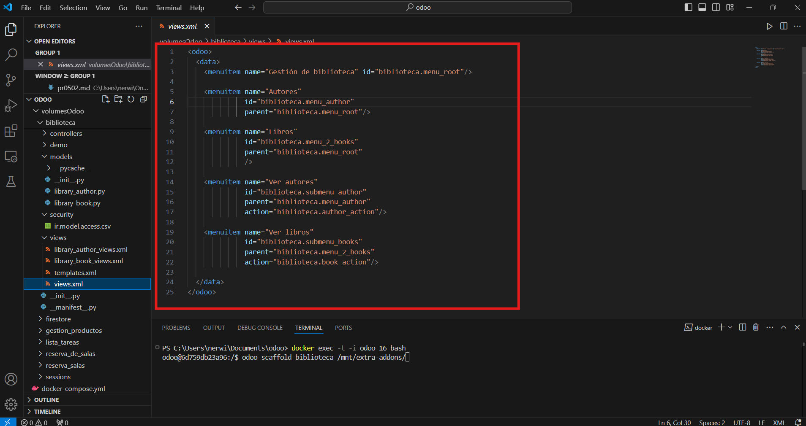
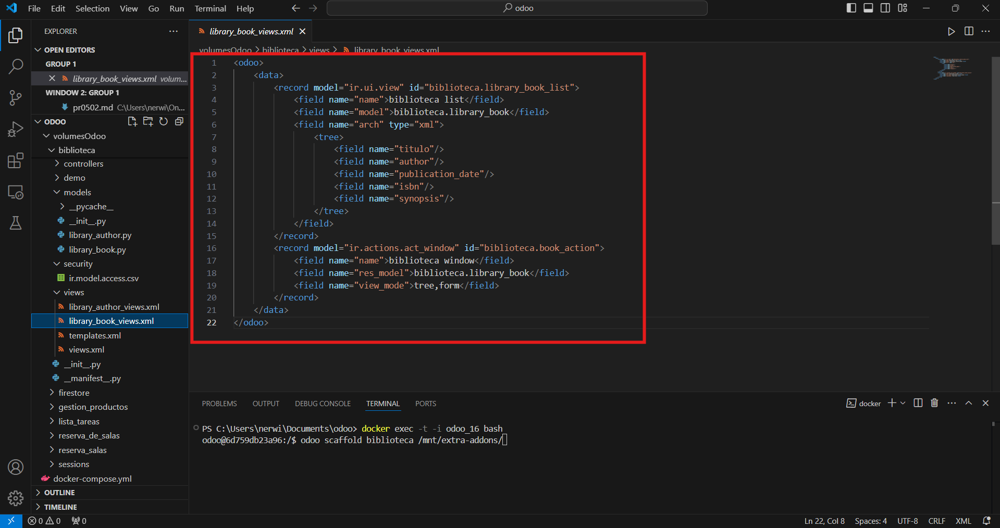
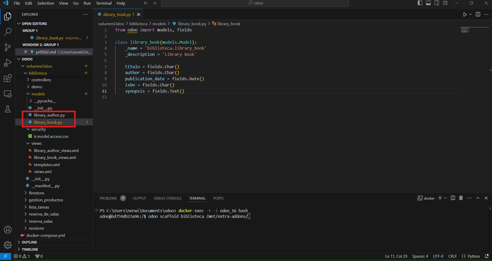
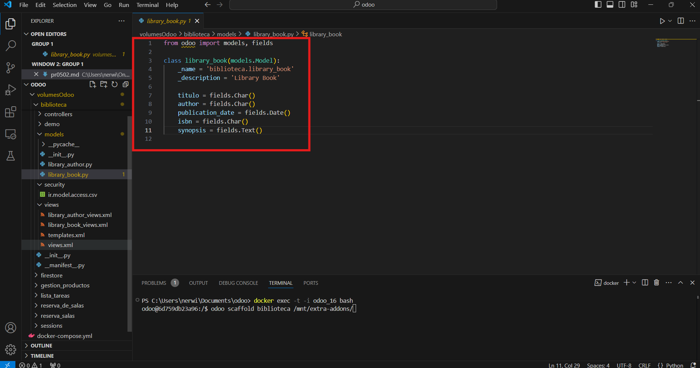
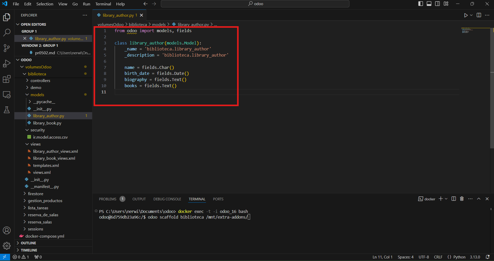
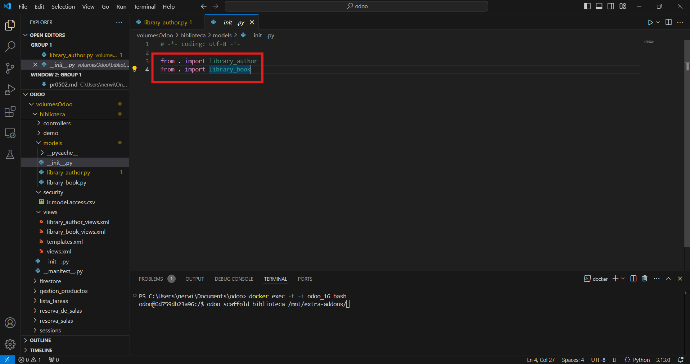
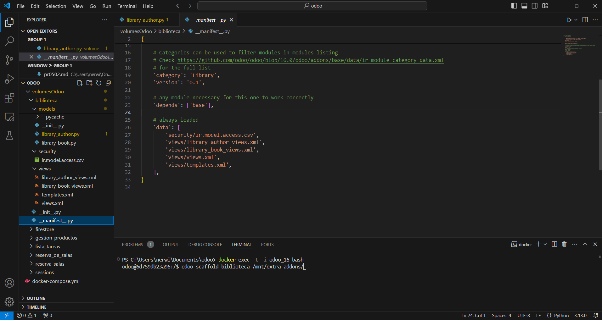

# Práctica 2 

1. Abro la consola de odoo


2. Ahora creo el modelo 


3. Creo las vistas


4. Relleno la información de las vistas




5. Creo dos modelos distintos


6. Añado el código de cada uno de los modelos



7. Añado los modelos al init


8. Añado las vistas al manifest



```
from odoo import models, fields

class library_author(models.Model):
    _name = 'biblioteca.library_author'
    _description = 'biblioteca.library_author'

    name = fields.Char()
    birth_date = fields.Date()
    biography = fields.Text()
    books = fields.Text()


```

```
from odoo import models, fields

class library_book(models.Model):
    _name = 'biblioteca.library_book'
    _description = 'Library Book'

    titulo = fields.Char()
    author = fields.Char()
    publication_date = fields.Date()
    isbn = fields.Char()
    synopsis = fields.Text()

```

```
id,name,model_id:id,group_id:id,perm_read,perm_write,perm_create,perm_unlink
access_biblioteca_library_author,biblioteca.library_author,model_biblioteca_library_author,base.group_user,1,1,1,1
access_biblioteca_library_book,biblioteca.library_book,model_biblioteca_library_book,base.group_user,1,1,1,1

```

```
<odoo>
    <data>
        <record model="ir.ui.view" id="biblioteca.library_book_list">
            <field name="name">biblioteca list</field>
            <field name="model">biblioteca.library_author</field>
            <field name="arch" type="xml">
                <tree>
                    <field name="name"/>
                    <field name="birth_date"/>
                    <field name="biography"/>
                    <field name="books"/>
                </tree>
            </field>
        </record>
        <record model="ir.actions.act_window" id="biblioteca.author_action">
            <field name="name">biblioteca window</field>
            <field name="res_model">biblioteca.library_author</field>
            <field name="view_mode">tree,form</field>
        </record>
    </data>
</odoo>
```


```
<odoo>
    <data>
        <record model="ir.ui.view" id="biblioteca.library_book_list">
            <field name="name">biblioteca list</field>
            <field name="model">biblioteca.library_author</field>
            <field name="arch" type="xml">
                <tree>
                    <field name="name"/>
                    <field name="birth_date"/>
                    <field name="biography"/>
                    <field name="books"/>
                </tree>
            </field>
        </record>
        <record model="ir.actions.act_window" id="biblioteca.author_action">
            <field name="name">biblioteca window</field>
            <field name="res_model">biblioteca.library_author</field>
            <field name="view_mode">tree,form</field>
        </record>
    </data>
</odoo>
```

```
<odoo>
    <data>
        <record model="ir.ui.view" id="biblioteca.library_book_list">
            <field name="name">biblioteca list</field>
            <field name="model">biblioteca.library_book</field>
            <field name="arch" type="xml">
                <tree>
                    <field name="titulo"/>
                    <field name="author"/>
                    <field name="publication_date"/>
                    <field name="isbn"/>
                    <field name="synopsis"/>
                </tree>
            </field>
        </record>
        <record model="ir.actions.act_window" id="biblioteca.book_action">
            <field name="name">biblioteca window</field>
            <field name="res_model">biblioteca.library_book</field>
            <field name="view_mode">tree,form</field>
        </record>
    </data>
</odoo>
```


```
<odoo>
  <data>
    <menuitem name="Gestión de biblioteca" id="biblioteca.menu_root"/>

    <menuitem name="Autores" 
              id="biblioteca.menu_author" 
              parent="biblioteca.menu_root"/>

    <menuitem name="Libros" 
              id="biblioteca.menu_2_books" 
              parent="biblioteca.menu_root"
              />

    <menuitem name="Ver autores" 
              id="biblioteca.submenu_author" 
              parent="biblioteca.menu_author"
              action="biblioteca.author_action"/>

    <menuitem name="Ver libros" 
              id="biblioteca.submenu_books" 
              parent="biblioteca.menu_2_books"
              action="biblioteca.book_action"/>

  </data>
</odoo>
```

```
# -*- coding: utf-8 -*-

from . import controllers
from . import models

```


```
# -*- coding: utf-8 -*-
{
    'name': "biblioteca",

    'summary': """
        Short (1 phrase/line) summary of the module's purpose, used as
        subtitle on modules listing or apps.openerp.com""",

    'description': """
        Long description of module's purpose
    """,

    'author': "My Company",
    'website': "https://www.yourcompany.com",

    # Categories can be used to filter modules in modules listing
    # Check https://github.com/odoo/odoo/blob/16.0/odoo/addons/base/data/ir_module_category_data.xml
    # for the full list
    'category': 'Library',
    'version': '0.1',

    # any module necessary for this one to work correctly
    'depends': ['base'],

    # always loaded
    'data': [
        'security/ir.model.access.csv',
        'views/library_author_views.xml',
        'views/library_book_views.xml',
        'views/views.xml',
        'views/templates.xml',
    ],
}

```
