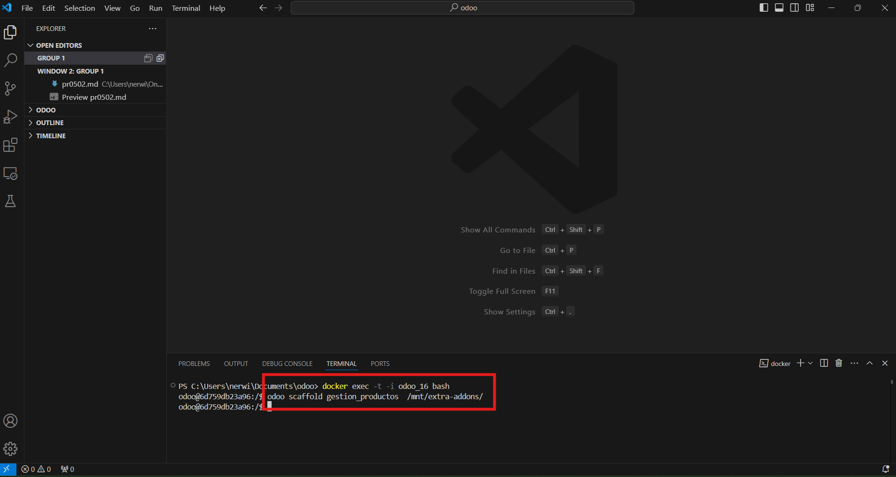
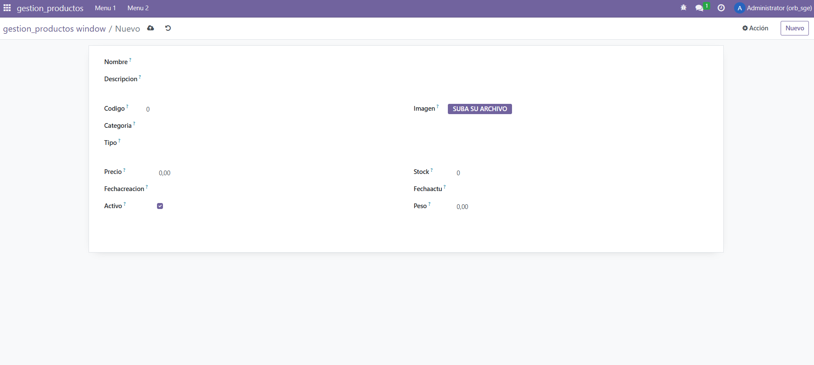

1. Primero me conecto a la consola de la base de datos y creo el módulo


2. Añado los campos al models.py

3. Actualizo los permisos del módulo en odoo si no los tiene tras instalarlo. Para ello hay que ir a Ajustes > Técnico > Módulos > Le añades los permisos

4. Debería de salir así al intentar crear un nuevo producto



# views.xml
```
<odoo>
  <data>
    <!-- explicit list view definition -->

    <record model="ir.ui.view" id="gestion_productos.list">
      <field name="name">gestion_productos list</field>
      <field name="model">gestion_productos.gestion_productos</field>
      <field name="arch" type="xml">
        <tree>
          <field name="nombre"/>
          <field name="descripcion"/>
          <field name="codigo"/>
          <field name="imagen"/>
          <field name="categoria"/>
          <field name="tipo"/>
          <field name="precio"/>
          <field name="stock"/>
          <field name="fechaCreacion"/>
          <field name="fechaActu"/>
          <field name="activo"/>
          <field name="peso"/>
        </tree>
      </field>
    </record>


    <!-- actions opening views on models -->

    <record model="ir.actions.act_window" id="gestion_productos.action_window">
      <field name="name">gestion_productos window</field>
      <field name="res_model">gestion_productos.gestion_productos</field>
      <field name="view_mode">tree,form</field>
    </record>


    <!-- server action to the one above -->

    <record model="ir.actions.server" id="gestion_productos.action_server">
      <field name="name">gestion_productos server</field>
      <field name="model_id" ref="model_gestion_productos_gestion_productos"/>
      <field name="state">code</field>
      <field name="code">
        action = {
          "type": "ir.actions.act_window",
          "view_mode": "tree,form",
          "res_model": model._name,
        }
      </field>
    </record>


    <!-- Top menu item -->

    <menuitem name="gestion_productos" id="gestion_productos.menu_root"/>

    <!-- menu categories -->

    <menuitem name="Menu 1" id="gestion_productos.menu_1" parent="gestion_productos.menu_root"/>
    <menuitem name="Menu 2" id="gestion_productos.menu_2" parent="gestion_productos.menu_root"/>

    <!-- actions -->

    <menuitem name="List" id="gestion_productos.menu_1_list" parent="gestion_productos.menu_1"
              action="gestion_productos.action_window"/>
    <menuitem name="Server to list" id="gestion_productos" parent="gestion_productos.menu_2"
              action="gestion_productos.action_server"/>

  </data>
</odoo>
```

# models.py
```
# -*- coding: utf-8 -*-

from odoo import models, fields, api


class gestion_productos(models.Model):
    _name = 'gestion_productos.gestion_productos'
    _description = 'gestion_productos.gestion_productos'

    nombre = fields.Char()
    descripcion = fields.Text()
    codigo = fields.Integer(required = True)
    imagen = fields.Image()
    categoria = fields.Selection(
        [
                ("jardin", "Jardin"),
                ("hogar", "Hogar"),
                ("electrodomesticos", "Electrodomésticos")
        ]
    )
    tipo = fields.Text()
    precio = fields.Float()
    stock = fields.Integer()
    fechaCreacion = fields.Date()
    fechaActu = fields.Datetime()
    activo = fields.Boolean(default = True)
    peso = fields.Float(
        digits=(10, 2)
    )


#     @api.depends('value')
#     def _value_pc(self):
#         for record in self:
#             record.value2 = float(record.value) / 100

```