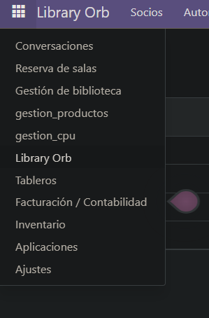
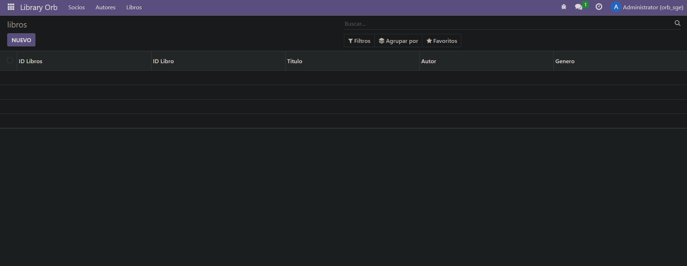

1. Primero me conecto a la consola de la base de datos y creo el módulo

2. Creo todo lo necesario

3. Actualizo los permisos del módulo en odoo si no los tiene tras instalarlo. Para ello hay que ir a Ajustes > Técnico > Módulos > Le añades los permisos


Resultado: 



# ir.model.access.csv
```
id,name,model_id:id,group_id:id,perm_read,perm_write,perm_create,perm_unlink
access_library_orb_socios,Acceso Socios,model_library_orb_socios,base.group_user,1,1,1,1
access_library_orb_autores,Acceso Autores,model_library_orb_autores,base.group_user,1,1,1,1
access_library_orb_libros,Acceso Libros,model_library_orb_libros,base.group_user,1,1,1,1

```

# autores.py
```
from odoo import models, fields, api


class autores(models.Model):
    _name = 'library_orb.autores'
    _description = 'library_orb.autores'

    nombre = fields.Text()
    pais_origen_id = fields.Many2one(
        string='Nombre del pais',
        comodel_name='res.country',
        ondelete='restrict',
    )

    libros_escritos_id = fields.One2many(
        string='Libros Escritos',
        comodel_name='library_orb.libros',
        inverse_name='autor_id',
    )
    

```

# libros.py
```
from odoo import models, fields, api


class libros(models.Model):
    _name = 'library_orb.libros'
    _description = 'library_orb.libros'

    autor_id = fields.Many2one(
        string='ID Libros',
        comodel_name='library_orb.autores',
        ondelete='restrict',
    )

    libro_id = fields.Many2one(
        string='ID Libro',
        comodel_name='library_orb.socios',
        ondelete='restrict',
    )

    titulo = fields.Text()
    autor = fields.Text()
    genero = fields.Selection(
        selection=[('novela', 'Novela'), ('drama', 'Drama'), 
                   ('ciencia_ficcion', 'Ciencia Ficción'), 
                   ('misterio', 'Misterio'), ('terror', 'Terror'), ('historico', 'Histórico')]
    )
    

```

# autores_views.xml
```
<odoo>
  <data>
    <record model="ir.ui.view" id="library_orb.autores">
      <field name="name">library_orb autores</field>
      <field name="model">library_orb.autores</field>
      <field name="arch" type="xml">
        <tree>
          <field name="nombre"/>
          <field name="pais_origen_id"/>
          <field name="libros_escritos_id"/>
        </tree>
      </field>
    </record>
    <record model="ir.actions.act_window" id="library_orb.action_autores">
      <field name="name">autores</field>
      <field name="res_model">library_orb.autores</field>
      <field name="view_mode">tree,form</field>
    </record>
  </data>
</odoo>
    

```

# libros_views.xml
```

<odoo>
  <data>
    <!-- explicit list view definition -->

    <record model="ir.ui.view" id="library_orb.libros">
      <field name="name">library_orb libros</field>
      <field name="model">library_orb.libros</field>
      <field name="arch" type="xml">
        <tree>
          <field name="autor_id"/>
          <field name="libro_id"/>
          <field name="titulo"/>
          <field name="autor"/>
          <field name="genero"/>
        </tree>
      </field>
    </record>

<!-- actions opening views on models -->

    <record model="ir.actions.act_window" id="library_orb.action_libros">
      <field name="name">libros</field>
      <field name="res_model">library_orb.libros</field>
      <field name="view_mode">tree,form</field>
    </record>

  </data>
</odoo>


```

# menus.xml
```
<odoo>
  <data>
    <menuitem name="Library Orb" id="library_orb.menu_root"/>

    <menuitem name="Socios" id="library_orb.menu_socios" parent="library_orb.menu_root"/>
    <menuitem name="Ver Socios" id="library_orb.menu_2_socios" parent="library_orb.menu_socios" action="library_orb.action_socios"/>

    <menuitem name="Autores" id="library_orb.menu_autores" parent="library_orb.menu_root"/>
    <menuitem name="Ver Autores" id="library_orb.menu_2_autores" parent="library_orb.menu_autores" action="library_orb.action_autores"/>

    <menuitem name="Libros" id="library_orb.menu_libros" parent="library_orb.menu_root"/>
    <menuitem name="Ver Libros" id="library_orb.menu_2_libros" parent="library_orb.menu_libros" action="library_orb.action_libros"/>
  </data>
</odoo>

    

```

# socios_views.py
```
from odoo import models, fields, api


class socios(models.Model):
    _name = 'library_orb.socios'
    _description = 'library_orb.socios'

    nombre = fields.Text()
    telefono = fields.Integer()
    
    libros_prestados_ids  = fields.One2many(
        string='Libros Prestados',
        comodel_name='library_orb.libros',
        inverse_name='libro_id',
    )
    

```


# manifest
```
# -*- coding: utf-8 -*-
{
    'name': "library_orb",

    'summary': """
        Short (1 phrase/line) summary of the module's purpose, used as
        subtitle on modules listing or apps.openerp.com""",

    'description': """
        Long description of module's purpose
    """,

    'author': "My Company",
    'website': "https://www.yourcompany.com",

    # Categories can be used to filter modules in modules listing
    # Check https://github.com/odoo/odoo/blob/16.0/odoo/addons/base/data/ir_module_category_data.xml
    # for the full list
    'category': 'Uncategorized',
    'version': '0.1',

    # any module necessary for this one to work correctly
    'depends': ['base'],

    # always loaded
    'data': [
        'views/socios_views.xml',
        'views/autores_views.xml',
        'views/libros_views.xml',
        'security/ir.model.access.csv',
        'views/menus.xml',
    ],
    # only loaded in demonstration mode
    'demo': [
        'demo/demo.xml',
    ],
}

    

```
