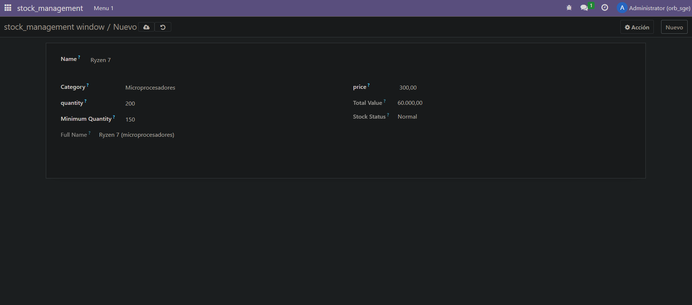
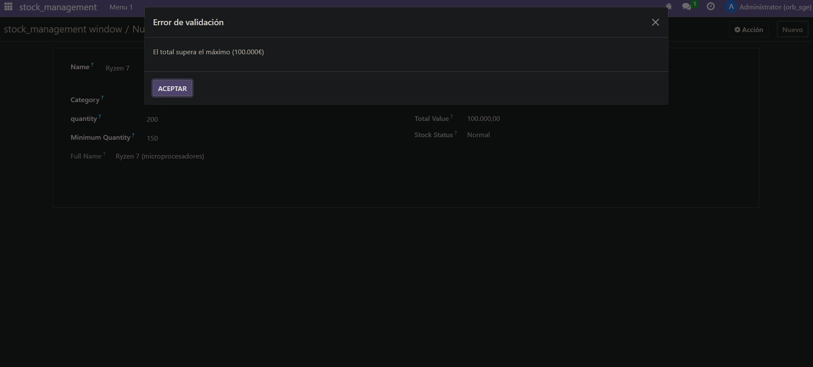

1. Primero me conecto a la consola de la base de datos y creo el módulo

2. Creo todo lo necesario

3. Actualizo los permisos del módulo en odoo si no los tiene tras instalarlo. Para ello hay que ir a Ajustes > Técnico > Módulos > Le añades los permisos


Resultado: 

Se autocalculan los campos total_value, stock status y full name, mientras que si superas los 100.000 de precio total te va a saltar el siguiente mensaje:


# models.py
```

# -*- coding: utf-8 -*-

from odoo import models, fields, api
from odoo.exceptions import ValidationError

class stock_product(models.Model):
    _name = 'stock_management.stock_product'
    _description = 'stock_management.stock_product'
    _sql_constraints = [
        ("unique_name", "unique(name)", "El nombre debe de ser único"),
        ("check_price", "CHECK(quantity > 0)", "La cantidad debe de ser positivo")
    ]

    name = fields.Text()
    category = fields.Selection([("microprocesadores", "Microprocesadores")])
    price = fields.Float("price")
    quantity = fields.Integer("quantity")
    total_value = fields.Float(compute = "_check_total_value", store=True)
    minimum_quantity = fields.Integer()
    stock_status = fields.Selection(
        [("normal", "Normal"),
         ("low_stock", "Low Stock")],
        compute='_compute_stock_status' )
    
    full_name = fields.Text(
        compute ="_compute_full_name",
        store=True,
        readOnly = True)


    @api.depends('stock_status', 'minimum_quantity')
    def _compute_stock_status(self):
        for p in self:
            if p.quantity > p.minimum_quantity:
                p.stock_status = "normal"
            else:
                p.stock_status = "low_stock"

    @api.depends('name', 'category')
    def _compute_full_name(self):
        for p in self:
            p.full_name = str(p.name) + " (" + str(p.category) + ")"
    
    @api.depends('price', 'quantity')
    def _check_total_value(self):
        for p in self:
            precioCalculado = p.price * p.quantity
            if  precioCalculado > 100000:
                raise ValidationError("El total supera el máximo (100.000€)")
            else:
                p.total_value = precioCalculado
                
    @api.constrains("price")
    def _check_price(self):
        for p in self:
            if p.price <= 0:
                raise ValidationError("El precio debe de ser > 0")
    
    @api.constrains("quantity")
    def _check_quantity(self):
        for p in self:
            if p.quantity < 0:
                raise ValidationError("La cantidad debe de ser mayor que 0")


    @api.constrains("category")
    def _check_category(self):
        for p in self:
            if not p.category:
                raise ValidationError("No se permiten productos sin categoría.")

```


# ir.model.access.csv
```

id,name,model_id:id,group_id:id,perm_read,perm_write,perm_create,perm_unlink
access_stock_management_stock_product,Stock Management,model_stock_management_stock_product,base.group_user,1,1,1,1

```


# views.xml
```

<odoo>
  <data>
    <!-- explicit list view definition -->

    <record model="ir.ui.view" id="stock_management.list">
      <field name="name">stock_management list</field>
      <field name="model">stock_management.stock_product</field>
      <field name="arch" type="xml">
        <tree>
          <field name="name"/>
          <field name="category"/>
          <field name="price"/>
          <field name="quantity"/>
          <field name="total_value"/>
          <field name="minimum_quantity"/>
          <field name="stock_status"/>
          <field name="full_name"/>
        </tree>
      </field>
    </record>


    <!-- actions opening views on models -->

    <record model="ir.actions.act_window" id="stock_management.action_window">
      <field name="name">stock_management window</field>
      <field name="res_model">stock_management.stock_product</field>
      <field name="view_mode">tree,form</field>
    </record>


    <!-- Top menu item -->

    <menuitem name="stock_management" id="stock_management.menu_root"/>

    <!-- menu categories -->

    <menuitem name="Menu 1" id="stock_management.menu_1" parent="stock_management.menu_root"/>

    <!-- actions -->

    <menuitem name="List" id="stock_management.menu_1_list" parent="stock_management.menu_1"
              action="stock_management.action_window"/>

  </data>
</odoo>

```