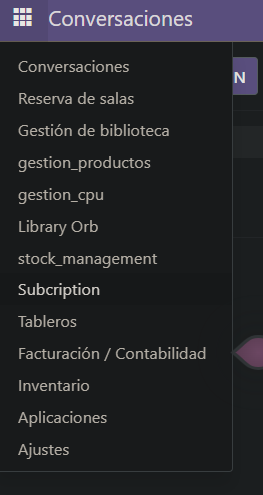
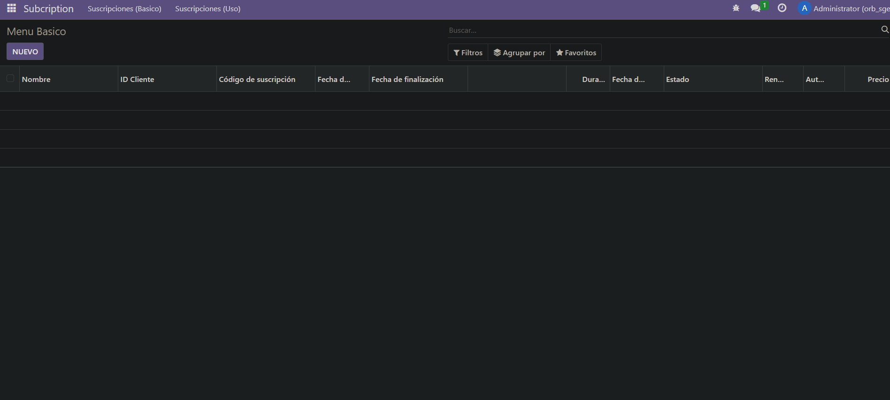
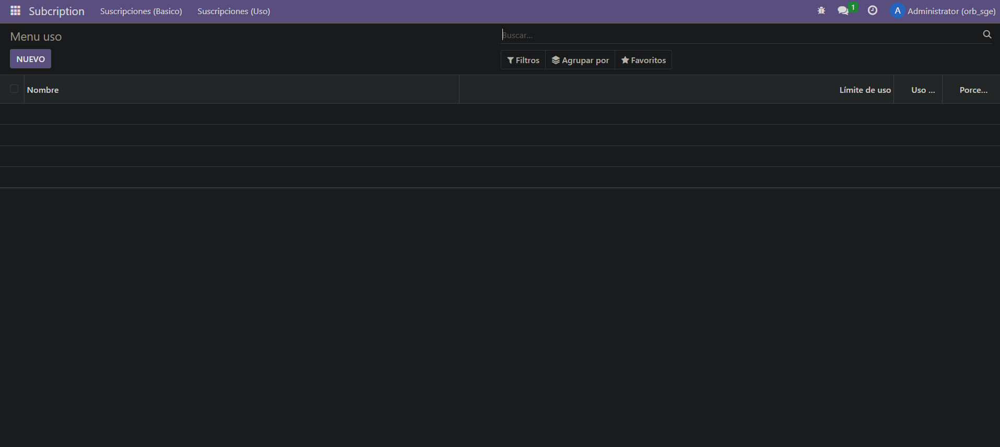

1. Primero me conecto a la consola de la base de datos y creo el módulo

2. Creo todo lo necesario

3. Actualizo los permisos del módulo en odoo si no los tiene tras instalarlo. Para ello hay que ir a Ajustes > Técnico > Módulos > Le añades los permisos

Resultado:

Básico:

Uso:


# models.py
```
# -*- coding: utf-8 -*-

from odoo import models, fields, api
from datetime import date, timedelta
from dateutil.relativedelta import relativedelta

class subscription(models.Model):
    _name = 'subscription.subscription'
    _description = 'subscription.subscription'

    name = fields.Char(required=True)
    customer_id = fields.Many2one(
        string='ID Cliente',
        comodel_name='res.partner',
        ondelete='restrict', 
        required=True)
    subscription_code = fields.Char(required=True)
    start_date = fields.Date(required=True)
    end_date = fields.Date()
    duration_months = fields.Integer(compute="_calcular_duracion", store=True)
    renewal_date = fields.Date()
    status = fields.Selection([('expired', 'Expirado'), ('active', 'Activo'), ('pending', 'Pendiente'), ('cancelled', 'Cancelado')])
    is_renewable = fields.Boolean()
    auto_renewal = fields.Boolean()
    price = fields.Float()
    usage_limit = fields.Integer()
    current_usage = fields.Integer()
    use_percent = fields.Float(compute="_calcular_uso", store=True)
    
    @api.depends('start_date', 'end_date')
    def _calcular_duracion(self):
        for p in self:
            if p.start_date and p.end_date:
                delta = relativedelta(p.end_date, p.start_date)
                p.duration_months = delta.years * 12 + delta.months
            else:
                p.duration_months = 0

    @api.depends('usage_limit', 'current_usage')
    def _calcular_uso(self):
        for p in self:
            queda = (p.usage_limit - p.current_usage)
            usado = 100 - queda
            p.use_percent = float(usado)

    def aumentar_dias(self):
        for p in self:
            if p.end_date:
                p.end_date += timedelta(days=15)

```


# ir.model.access.csv
```
id,name,model_id:id,group_id:id,perm_read,perm_write,perm_create,perm_unlink
access_subscription_subscription,Subscription,model_subscription_subscription,base.group_user,1,1,1,1

```


# menu.xml
```

<odoo>
  <data>
    <menuitem name="Subcription" id="subscription.menu_root"/>

    <menuitem name="Suscripciones (Basico)" id="subscription.menu_1_basico" parent="subscription.menu_root"/>
    <menuitem name="Ver menu" id="subscription.menu_2_basico" parent="subscription.menu_1_basico" action="subscription.action_basico"/>

    <menuitem name="Suscripciones (Uso)" id="subscription.menu_1_uso" parent="subscription.menu_root"/>
    <menuitem name="Ver menu" id="subscription.menu_2_uso" parent="subscription.menu_1_uso" action="subscription.action_uso"/>
  </data>
</odoo>

```

# vista_basica.xml
```
<odoo>
  <data>
    <!-- explicit list view definition -->

    <record model="ir.ui.view" id="subscription.menu_basico">
      <field name="name">Menu Basico</field>
      <field name="model">subscription.subscription</field>
      <field name="arch" type="xml">
        <tree decoration-danger="status=='expired'" decoration-info="status=='cancelled'" limit="15"> 
          <field name="name" string="Nombre"/>
          <field name="customer_id" string="ID Cliente"/>
          <field name="subscription_code" string="Código de suscripción"/>
          <field name="start_date" string="Fecha de inicio"/>
          <field name="end_date" string="Fecha de finalización" widget="remaining_days"/>
          <button name="aumentar_dias"
                  type="object"
                  string="Aumentar 15d"
                  class="btn-primary"
                  icon="fa-arrow-up"/>
          <field name="duration_months" string="Duración"/>
          <field name="renewal_date" string="Fecha de renovación"/>
          <field name="status" string="Estado" widget="radio"/>
          <field name="is_renewable" string="Renovable"/>
          <field name="auto_renewal" string="Auto renovar"/>
          <field name="price" string="Precio" attrs="{'invisible': [('status', '=', 'cancelled')]}"/>
        </tree>
      </field>
    </record>

    <!-- actions opening views on models -->
    <record model="ir.actions.act_window" id="subscription.action_basico">
      <field name="name">Menu Basico</field>
      <field name="res_model">subscription.subscription</field>
      <field name="view_mode">tree,form</field>
      <field name="view_id" ref="subscription.menu_basico"></field>
    </record>

  </data>
</odoo>

```

# vista_uso.xml
```
<odoo>
  <data>
    <!-- explicit list view definition -->

    <record model="ir.ui.view" id="subscription.menu_uso">
      <field name="name">Menú Básico</field>
      <field name="model">subscription.subscription</field>
      <field name="arch" type="xml">
        <tree decoration-danger="status=='expired'" decoration-info="status=='cancelled'" limit="15"> 
        
          <field name="name" string="Nombre"/>
          <field name="status" invisible="1"/>
          <field name="usage_limit" string="Límite de uso" widget="progressbar"/>
          <field name="current_usage" string="Uso actual"/>
          <field name="use_percent" string="Porcentaje de uso" decoration-danger="use_percent > 80"/>
        </tree>
      </field>
    </record>


    <!-- actions opening views on models -->

    <record model="ir.actions.act_window" id="subscription.action_uso">
      <field name="name">Menu uso</field>
      <field name="res_model">subscription.subscription</field>
      <field name="view_mode">tree,form</field>
      <field name="view_id" ref="subscription.menu_uso"></field>
    </record>

  </data>
</odoo>

```

# manifest.py
```
# -*- coding: utf-8 -*-
{
    'name': "subscription",

    'summary': """
        Short (1 phrase/line) summary of the module's purpose, used as
        subtitle on modules listing or apps.openerp.com""",

    'description': """
        Long description of module's purpose
    """,

    'author': "My Company",
    'website': "https://www.yourcompany.com",

    # Categories can be used to filter modules in modules listing
    # Check https://github.com/odoo/odoo/blob/16.0/odoo/addons/base/data/ir_module_category_data.xml
    # for the full list
    'category': 'Uncategorized',
    'version': '0.1',

    # any module necessary for this one to work correctly
    'depends': ['base'],

    # always loaded
    'data': [
        'security/ir.model.access.csv',
        'views/vista_basica.xml',
        'views/vista_uso.xml',
        'views/menu.xml',
        'views/templates.xml',
    ],
    # only loaded in demonstration mode
    'demo': [
        'demo/demo.xml',
    ],
}

```