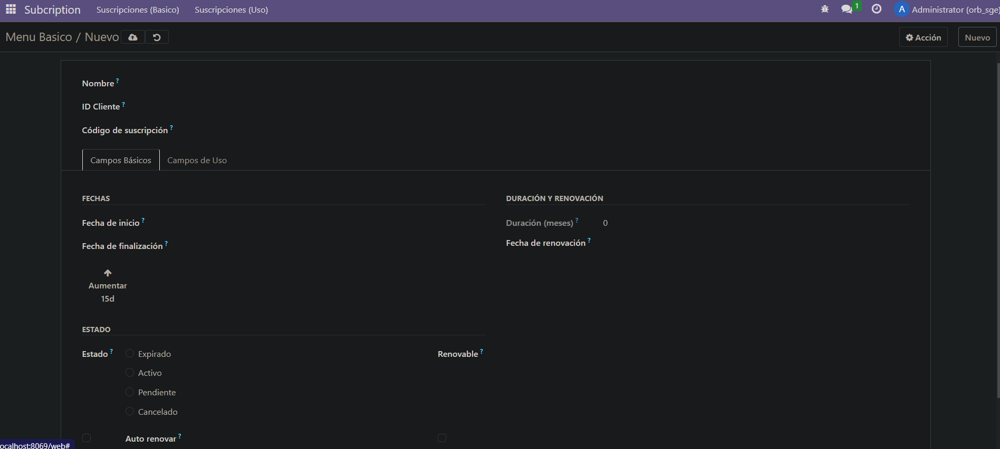
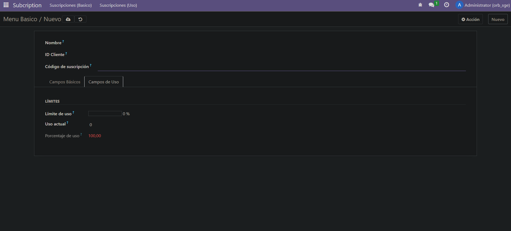

1. Primero me conecto a la consola de la base de datos y creo el módulo

2. Creo todo lo necesario

3. Actualizo los permisos del módulo en odoo si no los tiene tras instalarlo. Para ello hay que ir a Ajustes > Técnico > Módulos > Le añades los permisos

Resultado:




En este ejercicio solo tuve que cambiar las dos vistas:

# vista_basica.xml
```
<odoo>
  <data>
    <!-- explicit list view definition -->

    <record model="ir.ui.view" id="subscription.menu_basico">
      <field name="name">Menu Basico</field>
      <field name="model">subscription.subscription</field>
      <field name="arch" type="xml">
        <tree decoration-danger="status=='expired'" decoration-info="status=='cancelled'" limit="15"> 
          <field name="name" string="Nombre"/>
          <field name="customer_id" string="ID Cliente"/>
          <field name="subscription_code" string="Código de suscripción"/>
          <field name="start_date" string="Fecha de inicio"/>
          <field name="end_date" string="Fecha de finalización" widget="remaining_days"/>
          <button name="aumentar_dias"
                  type="object"
                  string="Aumentar 15d"
                  class="btn-primary"
                  icon="fa-arrow-up"/>
          <field name="duration_months" string="Duración"/>
          <field name="renewal_date" string="Fecha de renovación"/>
          <field name="status" string="Estado" widget="radio"/>
          <field name="is_renewable" string="Renovable"/>
          <field name="auto_renewal" string="Auto renovar"/>
          <field name="price" string="Precio" attrs="{'invisible': [('status', '=', 'cancelled')]}"/>
        </tree>
      </field>
    </record>

<record model="ir.ui.view" id="subscription.form_basico">
  <field name="name">Menu Basico Form</field>
  <field name="model">subscription.subscription</field>
  <field name="arch" type="xml">
    <form string="Formulario">
      <sheet>
        <group>
          <field name="name" string="Nombre"/>
          <field name="customer_id" string="ID Cliente"/>
          <field name="subscription_code" string="Código de suscripción"/>
        </group>
        <notebook>
          <page string="Campos Básicos">
            <group>
              <group string="Fechas" col="2">
                <field name="start_date" string="Fecha de inicio"/>
                <field name="end_date" string="Fecha de finalización" widget="remaining_days"/>
                <button name="aumentar_dias"
                  type="object"
                  string="Aumentar 15d"
                  class="oe_stat_button"
                  icon="fa-arrow-up"/>
              </group>
              <group string="Duración y Renovación" col="2">
                <field name="duration_months" string="Duración (meses)"/>
                <field name="renewal_date" string="Fecha de renovación"/>
              </group>
              <group string="Estado" col="3">
                <field name="status" string="Estado" widget="radio"/>
                <field name="is_renewable" string="Renovable"/>
                <field name="auto_renewal" string="Auto renovar"/>
              </group>
              <field name="price" string="Precio" attrs="{'invisible': [('status', '=', 'cancelled')]}"/>
            </group>
          </page>
          <page string="Campos de Uso">
            <group string="Límites">
              <field name="usage_limit" string="Límite de uso" widget="progressbar"/>
              <field name="current_usage" string="Uso actual"/>
              <field name="use_percent" string="Porcentaje de uso" decoration-danger="use_percent > 80"/>
            </group>
          </page>
        </notebook>
      </sheet>
    </form>
  </field>
</record>


    <!-- actions opening views on models -->
    <record model="ir.actions.act_window" id="subscription.action_basico">
      <field name="name">Menu Basico</field>
      <field name="res_model">subscription.subscription</field>
      <field name="view_mode">tree,form</field>
      <field name="view_id" ref="subscription.menu_basico"></field>
    </record>

  </data>
</odoo>


```

# vista_uso.xml
```
<odoo>
  <data>
    <!-- explicit list view definition -->

    <record model="ir.ui.view" id="subscription.menu_uso">
      <field name="name">Menú Básico</field>
      <field name="model">subscription.subscription</field>
      <field name="arch" type="xml">
        <tree decoration-danger="status=='expired'" decoration-info="status=='cancelled'" limit="15"> 
        
          <field name="name" string="Nombre"/>
          <field name="status" invisible="1"/>
          <field name="usage_limit" string="Límite de uso" widget="progressbar"/>
          <field name="current_usage" string="Uso actual"/>
          <field name="use_percent" string="Porcentaje de uso" decoration-danger="use_percent > 80"/>
        </tree>
      </field>
    </record>

<record model="ir.ui.view" id="subscription.form_uso">
  <field name="name">Menu Uso Form</field>
  <field name="model">subscription.subscription</field>
  <field name="arch" type="xml">
    <form string="Formulario">
      <sheet>
        <group>
          <field name="name" string="Nombre"/>
          <field name="customer_id" string="ID Cliente"/>
          <field name="subscription_code" string="Código de suscripción"/>
        </group>
        <notebook>
          <page string="Campos Básicos">
            <group>
              <group string="Fechas" col="2">
                <field name="start_date" string="Fecha de inicio"/>
                <field name="end_date" string="Fecha de finalización" widget="remaining_days"/>
                <button name="aumentar_dias"
                  type="object"
                  string="Aumentar 15d"
                  class="oe_stat_button"
                  icon="fa-arrow-up"/>
              </group>
              <group string="Duración y Renovación" col="2">
                <field name="duration_months" string="Duración (meses)"/>
                <field name="renewal_date" string="Fecha de renovación"/>
              </group>
              <group string="Estado" col="3">
                <field name="status" string="Estado" widget="radio"/>
                <field name="is_renewable" string="Renovable"/>
                <field name="auto_renewal" string="Auto renovar"/>
              </group>
              <field name="price" string="Precio" attrs="{'invisible': [('status', '=', 'cancelled')]}"/>
            </group>
          </page>
          <page string="Campos de Uso">
            <group string="Límites">
              <field name="usage_limit" string="Límite de uso" widget="progressbar"/>
              <field name="current_usage" string="Uso actual"/>
              <field name="use_percent" string="Porcentaje de uso" decoration-danger="use_percent > 80"/>
            </group>
          </page>
        </notebook>
      </sheet>
    </form>
  </field>
</record>


    <!-- actions opening views on models -->

    <record model="ir.actions.act_window" id="subscription.action_uso">
      <field name="name">Menu uso</field>
      <field name="res_model">subscription.subscription</field>
      <field name="view_mode">tree,form</field>
      <field name="view_id" ref="subscription.menu_uso"></field>
    </record>

  </data>
</odoo>


```