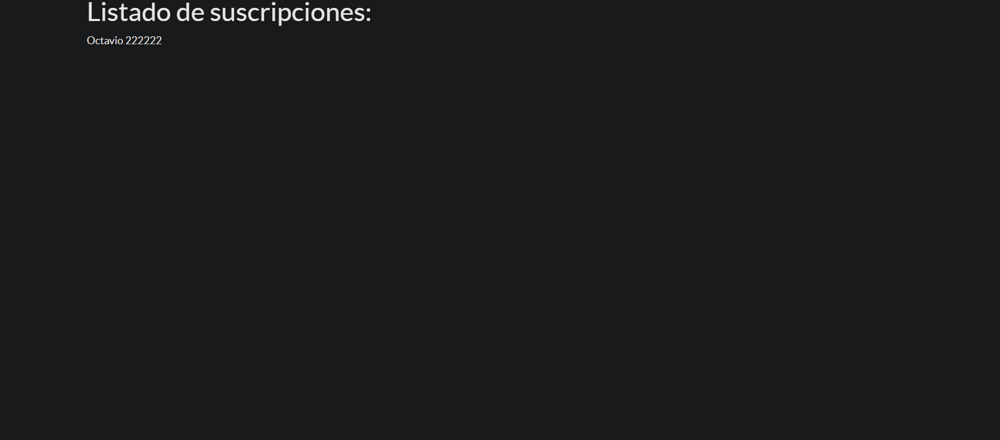
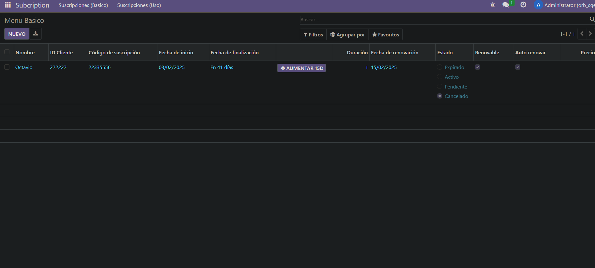
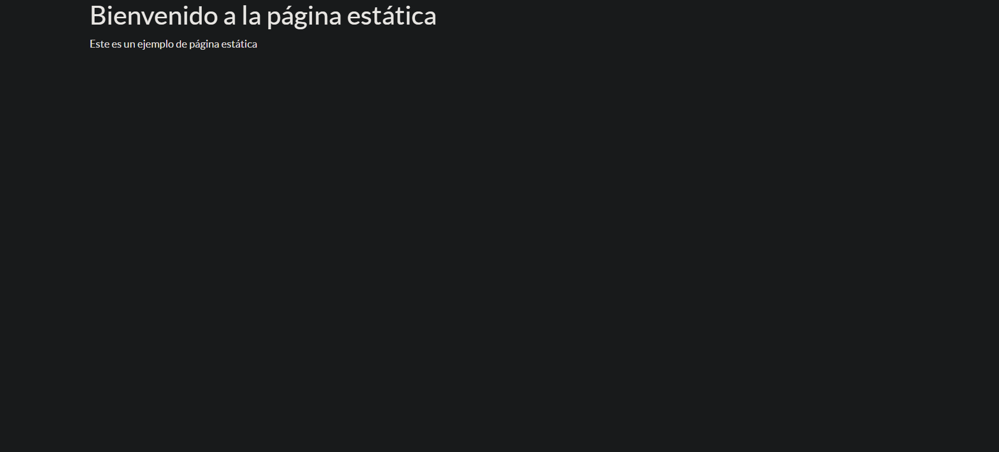

1. Primero me conecto a la consola de la base de datos y creo el módulo

2. Añado lo necesario

3. Actualizo los permisos del módulo en odoo si no los tiene tras instalarlo. Para ello hay que ir a Ajustes > Técnico > Módulos > Le añades los permisos

Para esta práctica solo he tenido que cambiar el controllers.py, manifest.py, y crear dos nuevas vistas.


# Resultados:
## Página dinámica:

Info de las suscripciones:


## Página estática:


# controllers.py
```

from odoo import http
from odoo.http import request


class Subscription(http.Controller):
    @http.route('/sub/static', type='http', auth='public', website=True)
    def hello_world(self, **kwargs):
        return http.request.render('subscription.static_web', {})
    
    @http.route('/sub/list', type='http', auth='public', website=True)
    def list_subscription(self, **kwargs):
        subs = request.env['subscription.subscription'].search([])
        return http.request.render('subscription.sub_list_web', {
            'subs': subs
        })


```


# manifest.py
```

# -*- coding: utf-8 -*-
{
    'name': "subscription",

    'summary': """
        Short (1 phrase/line) summary of the module's purpose, used as
        subtitle on modules listing or apps.openerp.com""",

    'description': """
        Long description of module's purpose
    """,

    'author': "My Company",
    'website': "https://www.yourcompany.com",

    # Categories can be used to filter modules in modules listing
    # Check https://github.com/odoo/odoo/blob/16.0/odoo/addons/base/data/ir_module_category_data.xml
    # for the full list
    'category': 'Uncategorized',
    'version': '0.1',

    # any module necessary for this one to work correctly
    'depends': ['base'],

    # always loaded
    'data': [
        'security/ir.model.access.csv',
        'views/vista_basica.xml',
        'views/vista_uso.xml',
        'views/menu.xml',
        'views/static_web.xml',
        'views/sub_list_web.xml',
        'views/templates.xml',
    ],
    # only loaded in demonstration mode
    'demo': [
        'demo/demo.xml',
    ],
}


```


# static_web.xml
```
<odoo>
    <template id="static_web" name="Página Estática">
        <t t-call="web.html_container">
            <div class="container">
                <h1>Bienvenido a la página estática</h1>
                <p>Este es un ejemplo de página estática</p>
            </div>
        </t>
    </template>
</odoo>
```

# sub_list_web.xml
```
<odoo>
    <template id="sub_list_web">
        <t t-call="web.html_container">
            <div class="container">
                <h1>Listado de suscripciones: </h1>
                <t t-foreach="subs" t-as="sub"> 
                    <div class="sub">
                        <span><t t-esc="sub.name"></t></span>
                        <span><t t-esc="sub.customer_id.name"></t></span>
                    </div>
                </t>
            </div>
        </t>
    </template>
</odoo>

```


